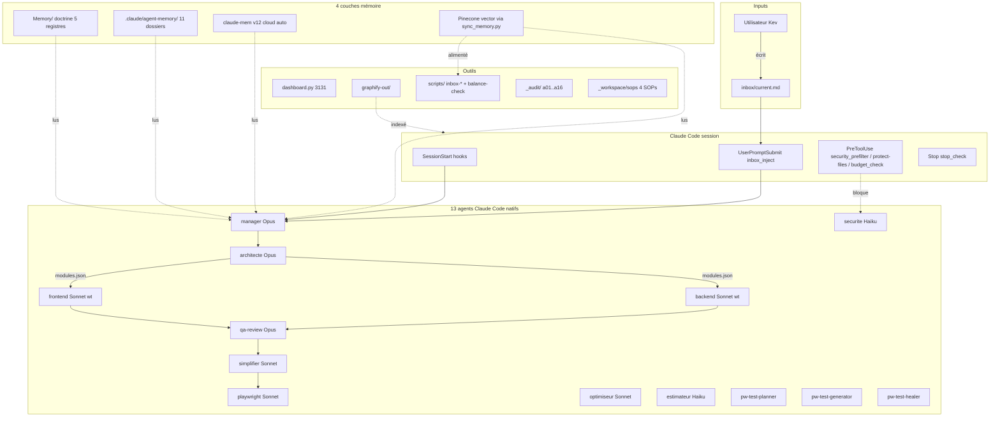

# Diagnostic complet — Espace_Opti

> Inventaire et synthèse, lecture seule, à utiliser comme contexte permanent pour toute nouvelle session Claude.ai / Claude Code.

- **Date production** : 2026-05-05
- **Producteur** : @manager (session principale Claude Code)
- **Branche / commit** : `main` @ `f8273fe`
- **Mode brief** : lecture seule, aucune modification, aucun commit
- **Sources** : Memory/ (5 registres + backlog), AGENTS.md, CLAUDE.md, settings.json, claude mcp list, claude plugin list, git log

---

## Sommaire des phases

| Phase | Statut | Output | Remarque |
|---|---|---|---|
| 0 — Mémoire | OK | AGENTS.md + 5 registres + SCHEMA + README lus | backlog.md vide (attendu, Phase γ) |
| 1 — Structure | OK | racine + .claude + _workspace + _audit + Memory cataloguées | drift `_workspace/skills` doublon |
| 2 — Intégrations | OK | 8 MCP recensés, 6 plugins, 8 hooks | drift obsidian MCP (déclaré, non connecté) |
| 3 — Documentation | OK | 5 .md racine + 4 .md docs/ + 9 .html docs/ catalogués | GUIDE.html (93k) historique |
| 4 — Backlog | OK | 41 anomalies, 19 OPEN, 15 MITIGATED, 4 RESOLVED | backlog.md non encore alimenté |
| 5 — Synthèse | OK | ce fichier | 5 sections |

---

## Phase 0 — État de la mémoire existante

### Registres (Memory/)

| Registre | Lignes | Entrées (`## ` hors index) | Dernière entrée | Backup |
|---|---:|---:|---|---|
| decisions.md | 107 | 7 | 2026-05-04 — Phase α commitée locale | `.bak_beta1` |
| learnings.md | 76 | 6 | 2026-05-03 — SKILL.md / AGENTS.md standards ouverts | `.bak_beta2` |
| blockers.md | 543 | 41 | 2026-05-04 — A39 habitude inbox.md | `.bak_beta3` |
| journal.md | 49 | 1 (mega-session 23/04→04/05) | 2026-04-23 → 2026-05-04 | `.bak_beta4` |
| evals.md | 88 | 6 | 2026-05-04 — A39 misdiagnostic + A45 confusion | `.bak_beta5` |
| backlog.md | 19 | 0 (vide) | n/a | aucun |

Scope prédominant : **espace_opti** (≈60 % des entrées), puis **transverse** (≈25 %), puis **vp** (≈15 %). socialflow et supply_chain_tower présents en index mais sans entrée.

### 5 dernières décisions (decisions.md)

1. 2026-05-04 — Phase α commitée locale, non pushée (a974660)
2. 2026-05-04 — Doctrine 5 registres + Option B (5 fichiers + backlog snapshot)
3. 2026-05-03 — NE PAS importer Ruflo, voler 4 patterns
4. 2026-05-01 — Règle 13 manager.md (délégation forcée code applicatif > 50 lignes)
5. 2026-04-30 — Système inbox multi-projets

### 5 derniers blockers ouverts (blockers.md)

1. **A24-bis** (ongoing) — Agent is not available inside subagents → limitation runtime Claude Code, workaround dispatch session principale
2. **A22** (ongoing) — manager.md tool Agent listé mais non invocable depuis subagent
3. **A8** (récurrence 5+) — Friction copy-paste prompt → inbox.md
4. **A28** (open) — Format custom .claude/agents/*.md vs standard SKILL.md
5. **A33** (open) — sync_memory.py vise `Documents\Obsidian Vault`, doctrine 5 registres vit dans `Espace_Opti\Memory\` (drift confirmé empiriquement, voir Phase 2)

### 5 derniers learnings (learnings.md)

1. 2026-05-03 — SKILL.md / AGENTS.md standards ouverts (60K+ stars cumulés)
2. 2026-05-03 — Hooks Anthropic officiels suffisent pour orchestration multi-agent solo (vs Ruflo)
3. 2026-04-30 — Test E2E réel = 4 critères distincts (POST + DB + reload + UI)
4. 2026-04-30 — Architecture solo bidirectionnelle obligatoire (front + back simultanés)
5. 2026-04-30 — CSP `connect-src` dev doit whitelister `localhost:<backend>`

---

## Phase 1 — Structure complète

### 1.1 Racine (15 dossiers + 30+ fichiers + 25+ .bak)

Dossiers : `.claude/`, `.git/`, `.pytest_cache/`, `Memory/`, `_audit/`, `_workspace/`, `__pycache__/`, `docs/`, `graphify-out/`, `inbox/`, `node_modules/`, `scripts/`, `specs/`, `templates/`, `test-results/`, `tests/`.

Fichiers principaux (taille / dernière modif pertinente) :
- `CLAUDE.md` (22.7 KB) — instructions projet, 7 backups historiques (.bak, .bak.niveau3, .bak_priorite1, .bak_sprint2, .bak_sprint3-bloc1/3, .bak_inbox_system, .bak_gamma2, .bak_epsilon2bis)
- `AGENTS.md` (2.3 KB) — standard ouvert
- `WORKSPACE_TUTORIAL.md` (24.2 KB)
- `PRD_WORKSPACE.md` (2 KB)
- `UI_GLOBAL.md` (187 B) — squelette « à remplir »
- `GUIDE.html` (93 KB) — guide HTML historique
- `dashboard.html` (97 KB) + `dashboard.py` (55 KB) — dashboard FastAPI port 3131 (4 backups chacun)
- `full.ps1` / `lite.ps1` — wrappers de lancement Claude Code
- `new-project.ps1` (24 KB) — créateur de projet
- `sync_memory.py` (12 KB) — vectorise vault Obsidian → Pinecone
- `write-inbox.ps1` (321 B) — wrapper programmatique inbox
- `.env` (273 B), `.env.template` (185 B), `.gitignore`, `.last_sync`, `.mcp.json` (185 B)

Backups : `*.bak`, `*.bak_priorite1`, `*.bak_sprint2/3`, `*.bak_inbox_system`, `*.bak_gamma2`, `*.bak_epsilon2`, `*.bak_epsilon2bis`, `*.bak_a25`, `*.bak_phase1`, etc. — discipline règle 6 respectée mais accumulation visible.

### 1.2 .claude/ — 13 agents, 8 hooks, 5 skills, 8 commands

Structure :
```
.claude/
├── agents/          (13 .md actifs + 11 .bak)
├── agent-memory/    (11 dossiers : 10 agents + workspace)
├── commands/        (8 slash commands)
├── hooks/           (5 .py + 3 .sh + 1 __pycache__/)
├── skills/          (5 .md custom skills)
├── worktrees/       (vide actuellement)
├── settings.json    (hooks + MCP + permissions)
├── settings.local.json  (~95 permissions accumulées)
├── agent-log.txt    (rolling log SubagentStart/Stop)
├── dashboard.log
├── dashboard.err.log
├── inbox_ready
├── memory_state.json
└── security-log.jsonl
```

#### 13 agents actifs (frontmatter résumé)

| Agent | Modèle | Tools | Memory | Skills (déclarés) | Couleur |
|---|---|---|---|---|---|
| manager | claude-opus-4-7 | Read, Write, Edit, Glob, Grep, Bash, **Agent** | project | prd-generator, architecture-decomposer, parallel-coordinator | orange |
| architecte | claude-opus-4-7 | Read, Glob, Grep, Write, Edit, Bash | project | docx, pdf-reading, pptx | purple |
| backend | sonnet | Read, Write, Edit, Glob, Grep, Bash | project | — (worktree isolation) | green |
| frontend | sonnet | Read, Write, Edit, Glob, Grep, Bash | project | frontend-design (worktree isolation) | pink |
| qa-review | claude-opus-4-7 | Read, Grep, Glob, Bash, Write | project | xlsx | yellow |
| simplifier | sonnet | Read, Write, Edit, Glob, Grep, Bash | project | — | cyan |
| playwright | sonnet | Read, Write, Bash, Glob | project | pdf-reading (mcp playwright) | blue |
| optimiseur | sonnet | Read | project | — | teal |
| securite | haiku | Read, Grep | non | — | red |
| estimateur | haiku | Read | non | — | gray |
| playwright-test-planner | sonnet | + tools mcp playwright-test (planner) | non | — | green |
| playwright-test-generator | sonnet | + tools mcp playwright-test (generator) | non | — | blue |
| playwright-test-healer | sonnet | + tools mcp playwright-test (healer/debug) | non | — | red |

#### 11 dossiers agent-memory/ (MEMORY_GLOBAL + MEMORY_PROJECT par agent)

architecte, backend, estimateur, frontend, manager, optimiseur, playwright, qa-review, securite, simplifier, **workspace** (`MEMORY_WORKSPACE.md` 756 B — historique 14/04 → 15/04, schéma jamais écrasé par new-project.ps1).

Les seuls non-vides à part workspace : **backend** (1839 B GLOBAL), **optimiseur** (1510 GLOBAL + 1268 PROJECT).

#### 8 hooks (5 Python + 3 bash)

| Hook | Type | Rôle |
|---|---|---|
| `security_prefilter.py` | PreToolUse Write/Edit | Pré-filtre regex 9 patterns OWASP — exit 1 si match clair → @securite |
| `budget_check.py` | PreToolUse Task | Bloque sur invocation Task si quota tokens < 10 % |
| `protect-files.sh` | PreToolUse Edit/Write/Bash | Bloque modifs sur `.env`, `credentials/`, `.git/` |
| `validate-env.sh` | PreToolUse Bash | Détecte placeholders dans `.env` au lancement service (uvicorn/npm run/streamlit/fastapi) |
| `inbox_inject.py` | UserPromptSubmit | Injecte contenu `inbox/current.md` comme additionalContext, vide ensuite |
| `inbox_watcher.py` | SessionStart + standalone | Lit inbox au démarrage session, marker `.claude/inbox_ready` |
| `session-start-phase0.sh` | SessionStart | Phase 0 standard : git status + check eslint/prettier/tsc PATH |
| `stop_check.py` | Stop | Détecte tâches potentiellement incomplètes dans dernier message Claude |

#### 5 skills custom (.claude/skills/)

| Skill | Purpose |
|---|---|
| `architecture-decomposer.md` | Découper PRD validé en modules parallèles |
| `parallel-coordinator.md` | Coordonner Frontend + Backend en parallèle (SOP-003) |
| `prd-generator.md` | Template + instructions PRD (SOP-002) |
| `qa-scorer.md` | Grille scoring 4 dimensions, seuil 80 % |
| `security-scanner.md` | 9 patterns vulnérabilité (source de vérité @securite) |

#### 8 slash commands

| Commande | Usage |
|---|---|
| `/start-prd` | Workflow SOP-002 |
| `/start-feature` | Feature dev avec interro Pinecone + Graphify avant plan |
| `/new-module` | Démarre dev d'un module |
| `/deliver` | Pipeline livraison SOP-004 |
| `/dashboard` | Lance dashboard FastAPI port 3131 |
| `/run-project` | Orchestration A→Z par @manager |
| `/loop` | Tâche récurrente (max 72 h) |
| `/status` | État workspace (modules, agents, git, tokens) |

#### settings.json — synthèse

- 4 env vars : `CLAUDE_CODE_EFFORT_LEVEL=xhigh`, `CLAUDE_CODE_DISABLE_ADAPTIVE_THINKING=1`, `CLAUDE_CODE_OUTPUT_STYLE=Explanatory`, `CLAUDE_CODE_THINKING=true`
- 2 MCP déclarés : `obsidian` (npx obsidian-mcp-server) + `pinecone` (npx @pinecone-database/mcp)
- 7 hooks PreToolUse + SubagentStart/Stop + Stop + UserPromptSubmit + SessionStart×2
- ~25 permissions allow + 4 permissions deny (mcp__code-review__*, mcp__code-simplifier__*, mcp__security-guidance__*, mcp__frontend-design__*) — ces plugins sont *enabled* (cf. Phase 2.2) mais leurs MCPs explicitement bloqués au profit des agents project équivalents.

### 1.3 _workspace/ — agents archivés, skills doublons, SOPs

```
_workspace/
├── agents/                README.md (placeholder, audit a14 confirme : actif=ailleurs)
├── agents_archive/        7 agents archivés (architecte/backend/frontend/playwright/qa-review/securite/simplifier)
├── skills/                5 skills DOUBLON STRICT de .claude/skills/ (mêmes 5 noms, ~mêmes tailles)
├── sops/                  4 SOPs
└── prd-template.md
```

#### 4 SOPs

| SOP | Objectif |
|---|---|
| SOP-001 — Nouveau projet | Déclencher `new-project.ps1` et dériver projet du template |
| SOP-002 — Création du PRD | 3 phases : reformulation → 8 questions → PRD.md |
| SOP-003 — Développement parallèle | Architecte → Frontend + Backend en parallèle, Sécurité temps réel |
| SOP-004 — Livraison | Checklist finale, DEPLOYMENT.md, ADR Obsidian, tag v1.0.0 |

#### 7 agents archivés

architecte.md, backend.md, frontend.md, playwright.md, qa-review.md, securite.md, simplifier.md — tous présents avec tailles 1.7-1.95 KB. Pas d'archive log explicite — supposés snapshot historique avant migration vers `.claude/agents/` au format Claude Code natif.

### 1.4 _audit/ — 16 scripts a01..a16

| Script | Audite |
|---|---|
| a01.py | Présence fichiers requis (settings.json, agents *.md, hooks) |
| a02.py | Intégrité agents : modèle attendu, mémoire, skills |
| a03.py | settings.json : structure JSON + BOM |
| a04.py | `~/.claude.json` user-level |
| a05.py | Syntaxe Python (`dashboard.py`, `sync_memory.py`) |
| a06.ps1 | Syntaxe PowerShell (full/lite/new-project.ps1) |
| a07.py | Scan secrets (Pinecone, OpenAI, AWS keys) |
| a08.py | Qualité dashboard (WebSocket, CORS) |
| a09.py | Dépendances Python (fastapi, uvicorn, pinecone, etc.) |
| a10.py | Connectivité MCP (Pinecone API) |
| a11.py | Vault Obsidian (`Documents\Obsidian Vault`) |
| a12.ps1 | État git |
| a13.py | CLAUDE.md (présence + lignes) |
| a14.py | Code parasite (`_workspace/agents/*.md` ne doit contenir que README) |
| a15.py | Encoding / BOM |
| a16.py | Smoke test dashboard (boot + endpoint) |

### 1.5 Memory/ — doctrine 5 registres + Obsidian + templates

```
Memory/
├── README.md            (2.5 KB, doctrine)
├── SCHEMA.md            (3.3 KB, format entrées)
├── decisions.md         (7.9 KB, 7 entrées)
├── learnings.md         (7.4 KB, 6 entrées)
├── blockers.md          (24 KB, 41 anomalies)
├── journal.md           (3.7 KB, 1 mega-session)
├── evals.md             (6.9 KB, 6 entrées)
├── backlog.md           (554 B, vide attendu Phase γ)
├── _templates/          (6 templates : decision, learning, blocker, journal-entry, eval, backlog-snapshot)
├── _dataview/dashboard.md  (4 requêtes Dataview)
├── .obsidian/           (community-plugins.json + workspace.json)
├── .gitignore
└── 5 backups *.bak_beta1..beta5  (un par registre, snapshot Phase β)
```

Phase β complète (5 backups beta1..beta5 confirment). Backlog.md attend `end-session.ps1` (Phase γ).

---

## Phase 2 — Intégrations externes

### 2.1 MCP servers — 8 recensés via `claude mcp list`

| MCP | Source | Statut | Notes |
|---|---|---|---|
| `chrome-devtools` | npx chrome-devtools-mcp@latest | ✓ Connected | 29 outils, audits perf dashboard / debug JS silent |
| `pinecone` | cmd /c npx @pinecone-database/mcp | ✓ Connected | Déclaré dans `.claude/settings.json` |
| `playwright-test` | cmd /c npx playwright run-test-mcp-server | ✓ Connected | Déclaré dans `.mcp.json` racine |
| `plugin:playwright:playwright` | npx @playwright/mcp@latest | ✓ Connected | Vient du plugin `feature-dev` |
| `plugin:claude-mem:mcp-search` | bun mcp-server.cjs (claude-mem 12.1.5) | ✓ Connected | Search persistent memory |
| `claude.ai Google Drive` | drivemcp.googleapis.com | ! Auth | Non utilisé sur Espace_Opti |
| `claude.ai Google Calendar` | calendarmcp.googleapis.com | ! Auth | Non utilisé |
| `claude.ai Gmail` | gmailmcp.googleapis.com | ! Auth | Non utilisé |

**Drift D-MCP-1 (NOUVEAU)** — `obsidian` MCP est déclaré dans `.claude/settings.json` (npx obsidian-mcp-server) mais **n'apparaît pas** dans `claude mcp list`. Cause probable : `OBSIDIAN_API_KEY` non setté en env (ou plugin Obsidian Local REST API désactivé). À surveiller pour décision A33 (vault unifié vs distincts).

**Drift D-MCP-2 (NOUVEAU)** — config dispersée : `.mcp.json` racine ne contient que `playwright-test` ; `obsidian` + `pinecone` vivent dans `.claude/settings.json`. Aucun bug, mais lecture cognitive coûteuse.

### 2.2 Plugins Claude Code — 6 actifs, scope user

| Plugin | Version | Statut |
|---|---|---|
| claude-mem (thedotmack) | 12.1.5 | ✔ enabled |
| code-review (claude-plugins-official) | unknown | ✔ enabled |
| code-simplifier (claude-plugins-official) | 1.0.0 | ✔ enabled |
| commit-commands (claude-plugins-official) | unknown | ✔ enabled |
| feature-dev (claude-plugins-official) | unknown | ✔ enabled |
| frontend-design (claude-plugins-official) | unknown | ✔ enabled |

Note : `settings.json` deny-list bloque les MCPs `code-review`, `code-simplifier`, `security-guidance`, `frontend-design` — politique « plugins agents disponibles, MCPs neutralisés au profit des agents project ».

### 2.3 Hooks — déclarés vs présents (cohérent)

8/8 hooks référencés dans `settings.json` sont présents physiquement :
- 5 Python : `security_prefilter.py`, `budget_check.py`, `inbox_inject.py`, `inbox_watcher.py`, `stop_check.py`
- 3 Bash : `protect-files.sh`, `validate-env.sh`, `session-start-phase0.sh`

Backups visibles : `inbox_inject.py.bak`, `inbox_inject.py.bak_gamma2`, `inbox_watcher.py.bak_gamma2`, `stop_check.py.bak`, `stop_check.py.bak.t23`, `budget_check.py.bak` — discipline règle 6 respectée.

Aucune divergence détectée (déclaré ≡ présent).

### 2.4 Pinecone + claude-mem + Graphify (triple/quadruple système mémoire)

- **`sync_memory.py`** vise toujours `C:\Users\caste\Documents\Obsidian Vault` (cf. ligne `OBSIDIAN_VAULT (default: ...)` du module). Vectorise `.md` → embeddings locaux `all-MiniLM-L6-v2` (384d) → Pinecone. **`.last_sync` = lundi 4 mai 2026 00:04:34** (≈hier). **Drift A33 confirmé empiriquement** : la doctrine 5 registres vit dans `Espace_Opti\Memory\` mais le vectoriseur lit le vault externe.
- **`claude-mem` v12.1.5** — plugin user, dashboard `localhost:37777` (capture automatique des actions agents). Non testé empiriquement dans ce diagnostic (lecture seule).
- **Graphify** — `graphify-out/graph.json` modifié dans le working tree (visible dans `git status`). Hook `PreToolUse Glob|Grep` injecte un rappel « Read GRAPH_REPORT.md before searching » si `graph.json` existe.
- **Memory/** doctrine — 5 registres + backlog snapshot, à racine projet (vu Phase 0).

→ **4 systèmes mémoire actifs en parallèle**, partiellement désynchros (cf. Section 4 « Trous »).

---

## Phase 3 — Documentation

### 3.1 .md / .html racine (résumés 1 ligne)

| Fichier | Taille | Rôle |
|---|---:|---|
| CLAUDE.md | 22.7 KB | Instructions projet (modes lite/full, agents, MCP, slash, mémoire, OS, balance, résilience, règles critiques, tips, graphify, discipline persisted, scripts inbox) |
| AGENTS.md | 2.3 KB | Standard ouvert agents IA (pacte VP-bench, règles non-négo, anomalies majeures, conventions, démarrage session) |
| WORKSPACE_TUTORIAL.md | 24.2 KB | Tutoriel quotidien (lancer environnement, mémoire, déclencher agents, workflow feature) |
| PRD_WORKSPACE.md | 2 KB | PRD du workspace lui-même (vision + historique 14-15/04) |
| UI_GLOBAL.md | 187 B | Squelette UI/UX commun (à remplir) |
| GUIDE.html | 93 KB | Guide HTML historique |
| dashboard.html / dashboard.py | 97/55 KB | Dashboard FastAPI port 3131 (UI + serveur) |

### 3.2 docs/ — 4 .md + 9 .html

| Fichier | Rôle |
|---|---|
| docs/inbox-system.md | Système inbox multi-projets (procédures, scripts, archive) |
| docs/anomalies-orchestration.md | Anomalies runtime Claude Code (A24-bis détaillée) |
| docs/quand-quel-agent.md | Tableau de décision agent ↔ tâche |
| docs/git-aliases.md | Aliases worktree-cleanup |
| docs/index.html | Sommaire HTML |
| docs/bestpractices.html | Best practices |
| docs/decisions.html | Décisions historique |
| docs/organisation.html | Organisation workspace |
| docs/pipeline.html | Pipeline 7 phases |
| docs/reference.html | Référence rapide |
| docs/stack.html | Stack technique |
| docs/tips.html | Tips utilisateur |
| docs/tutoriel.html | Tutoriel HTML |
| docs/shared.css | Stylesheet partagée |

Note : `docs/inbox-system.md.bak_stabilisation` est l'unique backup dans `docs/`.

---

## Phase 4 — Backlog actuel

### 4.1 Anomalies — 41 entrées dans Memory/blockers.md

Statuts (cumul) :
- **OPEN** : 19 (15 `OPEN` + 1 ongoing limitation upstream + 1 ongoing limitation runtime + 1 W20 + 1 récurrence 5+)
- **MITIGATED** : 15 (9 simple + 2 fix γ-pre-2 + 1 procédural + 1 procédural strict + 1 méthodologique + 1 en cours)
- **RESOLVED** : 4 (W14, W15, A11, A37 fix γ-pre-2)
- **POSITIVE** (méta-positif) : 1 (A36)
- **MERGED** : 1 (A23 → A8)

### 4.2 Top 5 anomalies critiques actuelles

1. **A24-bis CRITICAL** (ongoing limitation upstream) — `Agent is not available inside subagents`. Workaround : invoquer @manager *top-level* depuis session principale.
2. **A22** (ongoing) — `manager.md` liste tool `Agent` mais non invocable depuis sub-dispatch (corollaire A24-bis).
3. **A8** (récurrence 5+) — Friction copy-paste prompt → `inbox.md`. Item #38 / #95 ouvert (helper `prep-prompt.ps1`).
4. **A28** (open) — Format custom `.claude/agents/*.md` vs standard SKILL.md. Pivot prévu (item #66).
5. **A33** (open) — `sync_memory.py` cible vault Obsidian externe, doctrine vit dans `Memory/`. Confirmé empiriquement Phase 2 (`.last_sync` = 2026-05-04 00:04:34 sur vault externe).

### 4.3 Items résolus (≈3 dernières semaines)

VP : W14 (PostCSS), W15 (auth bidirectionnelle), W15-bis (PgBouncer asyncpg), W15-ter (CSP connect-src dev), W18 (E2E réel 4 critères).

Espace_Opti / méta : A11 (Phase 0 codifiée), A37 (dual-system inbox aligné γ-pre-2), Phase α commit `a974660`, Phase β `82b4aa2`.

### 4.4 Items ouverts (non-blockers, depuis Memory + git log)

- **#15** : doctrine 5 registres (initiée — Phase α/β complétées, γ pending)
- **#41** : règle 13 manager.md complète avec justification écrite obligatoire
- **#49** : VP migration 13 refs résiduelles `inbox.md` → `inbox/current.md`
- **#51** : redesign manager.md mode plan-and-handoff (workaround A24-bis structurel)
- **#54** : étendre @qa-review check signature spec vs livraison
- **#55** : `git wt-clean` étendu (worktrees lockés orphelins)
- **#62** : `end-session.ps1` (alimente backlog.md)
- **#65, #66** : adopter SKILL.md / AGENTS.md, pivoter agents custom
- **#69-bis** : graver schéma ReasoningBank avant outillage
- **#73, #74, #75** : workers `audit` / `testgaps` (4 patterns volés à Ruflo)
- **#80, #82** : seuil troncature hook SessionStart (A31)
- **#85, #86** : décider stratégie vault Obsidian (unifié vs distincts) — A33
- **#87** : Phase 0 inclut pré-autorisation dossiers cibles
- **#88** : templates briefs grep structurel only (vs `wc -l` fragile)
- **#94, #95** : renommage `inbox.md.LEGACY-DO-NOT-USE` (β-3 fait) + script wrapper `prep-prompt.ps1`
- **#97, #98** : items γ initiés
- **#105, #108, #111, #113** : disciplines méta-Claude.ai (audit avant analyse, code avant nom)
- Supply Chain Tower PoC — deadline 2026-05-25

### 4.5 Phases en cours

| Phase | Statut | Marqueurs visibles |
|---|---|---|
| α — Doctrine commitée locale | DONE | commit `a974660` |
| β — Population 5 registres + backups beta1..beta5 | DONE | commit `82b4aa2`, 61 entrées historique 3 jours |
| β-3 (γ-pre-2/3) — Fix dual-system inbox + paths | DONE | commits `e0a451c`, `e460ed6`, `e60086a` |
| ε — Discipline persisted output + scripts inbox roles | DONE | commit `f8273fe` (règle 14 manager) |
| **γ** — `end-session.ps1` + hook session-start auto-injection top-N | **TODO** | backlog.md vide, item #62 |
| **δ** — Adopter outils standards (adr-tools, claude-devtools, obra/superpowers, Portless) + migration #66 SKILL.md | **TODO** | item #65/66 |

### 4.6 Indicateurs cumulés

- Commits Espace_Opti depuis 2026-04-01 : **46** (depuis a974660 fin α : 5)
- Commits VP cumulés : 8 (W12-W18 + smoke)
- Doctrine mémoire : adoptée, à jour Phases α/β/ε ; γ pending
- Pacte VP-bench-de-test : respecté (60+ items Espace_Opti générés depuis VP)
- Discipline délégation manager : appliquée (règle 13/14, A18/A19 mitigées)

---

## Phase 5 — Synthèse stratégique

### Section 1 — État global

Espace_Opti est un méta-projet d'orchestration **mature** :
- 13 agents Claude Code natifs (frontmatter à jour, isolation worktree pour frontend/backend, mémoire 3 couches).
- 8 hooks (5 Python + 3 bash) cohérents avec settings.json.
- 4 systèmes mémoire en parallèle (Memory/ doctrine + agent-memory/ + claude-mem v12 + Pinecone).
- 6 plugins user actifs ; 8 MCPs (5 connectés + 3 auth en attente).
- 4 SOPs codifiées + 5 skills + 8 slash commands + 16 scripts d'audit.
- 41 anomalies tracées (19 OPEN, 15 MITIGATED, 4 RESOLVED).
- Phases α / β / ε **DONE** (commits sur main, locales) ; **γ et δ TODO**.

Pacte VP-bench-de-test **respecté**. Discipline délégation manager **codifiée et observée**. Balance outillage/livraison référence 67 % outillage (état `WARNING`, à remettre sous 30 % après prochain push VP/SocialFlow).

### Section 2 — Architecture vivante



### Section 3 — Capacités disponibles

**13 agents (résumé table cf. Phase 1.2)** — chacun a un rôle précis dans le pipeline 7 phases (PRD → Architecture → Dev parallèle → QA → Simplification → Tests E2E → Livraison).

**8 hooks** (cf. Phase 2.3) — sécurité (`security_prefilter`, `protect-files`, `validate-env`), orchestration (`inbox_inject`, `inbox_watcher`, `session-start-phase0`), garde-fous (`budget_check`, `stop_check`).

**5 skills** (cf. Phase 1.2) — `architecture-decomposer`, `parallel-coordinator`, `prd-generator`, `qa-scorer`, `security-scanner`.

**8 slash commands** — `/start-prd`, `/start-feature`, `/new-module`, `/deliver`, `/dashboard`, `/run-project`, `/loop`, `/status`.

**8 MCPs** — 5 connectés (chrome-devtools, pinecone, playwright-test, playwright via plugin, claude-mem search), 3 Google en attente d'auth.

**6 plugins** — claude-mem (mémoire cross-session), code-review, code-simplifier, commit-commands (`/commit`, `/commit-push-pr`, `/clean_gone`), feature-dev (planner/architect/explorer/reviewer), frontend-design.

### Section 4 — Trous identifiés

#### 4.A Items backlog critiques non-résolus

- **A24-bis** (ongoing) — limitation runtime Claude Code, workaround validé mais coûteux (item #51 redesign manager plan-and-handoff).
- **A8 récurrence 5+** — friction copy-paste inbox (items #38, #95).
- **A33 + drift D-MCP-1** — `sync_memory.py` vise vault externe, MCP `obsidian` non connecté → décision Q-Sync différée (#85, #86).
- **A28** — pivot vers SKILL.md / AGENTS.md non commencé (#65, #66).
- **#62 end-session.ps1** — backlog.md vide tant que Phase γ non lancée.

#### 4.B Anomalies récurrentes (top 5)

| Code | Récurrences | Symptôme | Statut |
|---|---:|---|---|
| A8 | 5+ | Copy-paste inbox.md raté | OPEN priorité |
| A39 | 3 | Habitude utilisateur ancien path inbox.md | MITIGATED β-3 |
| A24 | 3 | Comportement non-déterministe @manager | MITIGATED γ-pre-2 |
| A15 | 3 | Backlog conv volatile vs fichier | MITIGATED en cours |
| A2 | ongoing | Worktrees agent-* lockés non nettoyés | MITIGATED |

#### 4.C Drift / doublons découverts pendant le diagnostic

- **D-1 DOUBLON** — `_workspace/skills/*.md` est doublon strict de `.claude/skills/*.md` (mêmes 5 noms, ~tailles équivalentes). L'un des deux est mort. À investiguer (`a14` audit ne le checke pas, à étendre).
- **D-MCP-1** — MCP `obsidian` déclaré dans `.claude/settings.json` mais absent de `claude mcp list` (env var manquante probable). Cohérent avec A33.
- **D-MCP-2** — Config MCP dispersée : `.mcp.json` (playwright-test seul) vs `.claude/settings.json` (obsidian + pinecone). Pas un bug, friction cognitive.
- **D-2 BACKUPS** — ~30 fichiers `*.bak*` cumulés à la racine + dans `.claude/agents/` + `.claude/hooks/` + `Memory/`. Discipline règle 6 respectée mais aucun script de rétention/cleanup.
- **D-3 PRD historique** — `PRD_WORKSPACE.md` mentionne 9 agents (estimateur compris) ; `CLAUDE.md` documente 13 agents (incl. trio playwright-test-*). Désynchro doc-réalité, sans impact runtime.

#### 4.D Outils manquants vs besoins identifiés (extraits Memory)

- helper `prep-prompt.ps1` (#95) → casser A8 récurrence 5+
- script `mask-env-safe.sh` standardisé (#40) → anti-A16 structurel
- helper `set-env-var.ps1` (#38) → anti-A10 (2 Notepad)
- `end-session.ps1` (#62) → snapshot backlog automatique Phase γ
- `bootstrap-espace-opti.ps1` (déjà dans `scripts/`, 17 KB — vérifier qu'il propage UTF-8 console)

### Section 5 — Prochaines étapes recommandées (priorisées)

| # | Étape | Pourquoi | Item / Anomalie |
|---|---|---|---|
| 1 | **Phase γ** : `end-session.ps1` + hook session-start auto-injection top-N | Alimenter `backlog.md` (vide), résoudre A15 structurellement | #62, #67, #68 |
| 2 | **Migration #66** agents `.md` → `SKILL.md` + adopter standard AGENTS.md (déjà créé) sur tous registres | Standard ouvert 60K+ stars, compatibilité Codex/Cursor/Gemini | #65, #66, A28 |
| 3 | **Décision Q-Sync vault Obsidian** : unifié `Memory/` ou maintenir vault externe + sync incrémental | Drift A33 + D-MCP-1 (obsidian non connecté) | #85, #86, A33 |
| 4 | **#51 redesign @manager** mode plan-and-handoff | Workaround structurel A24-bis | A22, A24-bis |
| 5 | **VP migration #49** — 13 refs résiduelles `inbox.md` → `inbox/current.md` | Cohérence cross-projet (pacte VP-bench) | #49 |
| 6 | **Helper `prep-prompt.ps1`** wrapper Notepad → `inbox/current.md` | Casser récurrence 5+ A8 | #38, #95 |
| 7 | **Cleanup backups** : script de rétention `.bak_<phase>` après merge phase | Réduire D-2 sans casser règle 6 | nouveau |
| 8 | **Étendre `_audit/a14`** pour détecter doublons `_workspace/skills` ↔ `.claude/skills` | Empêcher D-1 de réapparaître | nouveau |
| 9 | **Supply Chain Tower PoC** | Deadline 2026-05-25 | échéance externe |

---

## Anomalies découvertes pendant ce diagnostic (non encore dans Memory/blockers.md)

> Le brief impose lecture seule — ces anomalies sont **listées ici mais non gravées** dans `Memory/blockers.md`. Phase 6 (optionnelle) pour validation utilisateur explicite avant insertion.

- **D-MCP-1** — MCP `obsidian` déclaré, non connecté à runtime → probable `OBSIDIAN_API_KEY` non setté ou plugin Obsidian REST API désactivé.
- **D-MCP-2** — config MCP dispersée racine (`.mcp.json`) vs `.claude/settings.json`.
- **D-1** — `_workspace/skills/` doublon strict de `.claude/skills/` (5 fichiers, mêmes noms).
- **D-2** — accumulation ~30 backups `*.bak*` sans script de rétention.
- **D-3** — `PRD_WORKSPACE.md` désynchro (9 agents annoncés vs 13 réels).
- **D-4** — `agent-memory/` : 8/11 dossiers ont des MEMORY_GLOBAL/PROJECT minimaux (~270-400 B) — soit jamais alimentés, soit fichiers placeholder. Seuls `backend`, `optimiseur`, `workspace` ont du contenu réel.

---

## Questions ouvertes pour l'utilisateur

1. **A33 / Q-Sync** — vault Obsidian externe (`Documents\Obsidian Vault`) doit-il rester source de Pinecone, ou pivoter `sync_memory.py` vers `Espace_Opti\Memory\` ?
2. **D-1 doublon skills** — supprimer `_workspace/skills/` ou réinventer un rôle distinct (archive historique) ?
3. **D-MCP-1** — vouloir maintenir le MCP `obsidian` ? Si oui, configurer `OBSIDIAN_API_KEY` ; sinon, retirer du `settings.json`.
4. **Phase γ** — démarrer `end-session.ps1` cette semaine, ou prioriser livraison VP/SocialFlow d'abord (cf. balance 67 % outillage `WARNING`) ?
5. **Migration #66 SKILL.md** — découper en sous-phases δ-1 / δ-2 ou refactor en un coup ?
6. **D-3 PRD désynchro** — mettre à jour `PRD_WORKSPACE.md` pour refléter les 13 agents actuels ?

---

## Métriques rapport

- **Hash git de référence** : `f8273fe` (branche `main`, working tree avec `M graphify-out/graph.json` toléré)
- **Lecture Phase 0** : 9 fichiers (AGENTS.md + 5 registres + README + SCHEMA + backlog), 0 modification
- **Inventaire Phase 1** : 5 grands inventaires (.claude/, _workspace/, _audit/, Memory/, racine)
- **Phase 2** : 8 MCPs vérifiés, 6 plugins listés, 8 hooks cross-checkés (déclaré ≡ présent)
- **Phase 3** : 5 .md racine + 4 .md docs/ + 9 .html docs/ catalogués
- **Phase 4** : 41 anomalies analysées (statuts + récurrences), 6 phases identifiées (α/β/ε DONE, γ/δ TODO)
- **Phase 5** : ce fichier (~600 lignes structuré)
- **Anomalies inédites découvertes** : 4 drift D-MCP-1, D-MCP-2, D-1, D-2 (+ D-3, D-4 mineures)
- **Production** : 1 fichier `docs/diagnostic-complet-espace-opti.md` (nouveau, lecture seule respectée — aucune modification d'existant)

---

## Après validation

STOP utilisateur. Aucun commit, aucune action automatique.
L'utilisateur lit ce fichier et décide quelles questions Section « Questions ouvertes » prioriser.
